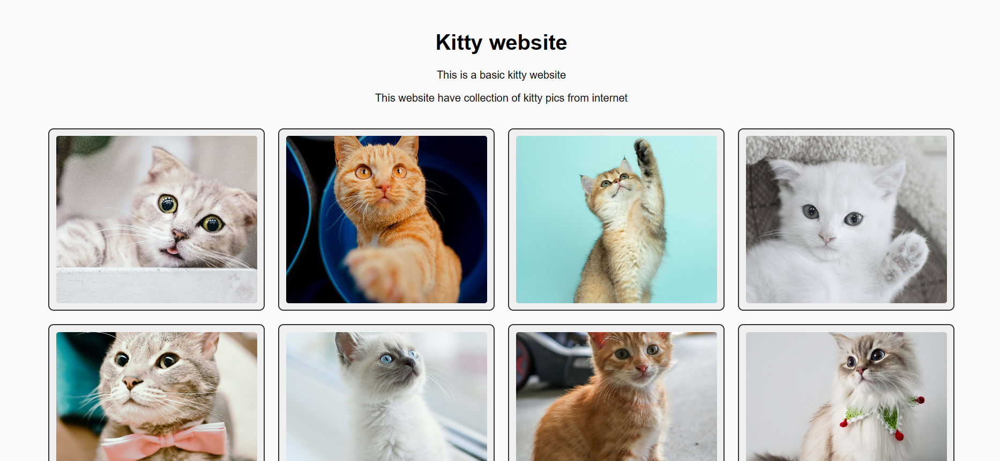

# Kitty-website

This is a basic kitty website using html and css.

# Preview

# Demo

check out this : https://kitty-website-xi.vercel.app/

# Tech stack

1. Html
2. CSS

# Local Installation

1. Clone the repository git clone https://github.com/elite_punith/Kitty-website.git

2. Navigate into the project directory cd KITTY-WEBSITE

3. Open index.html in your browser to view the site

